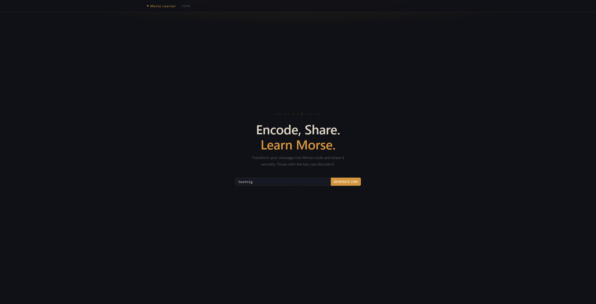
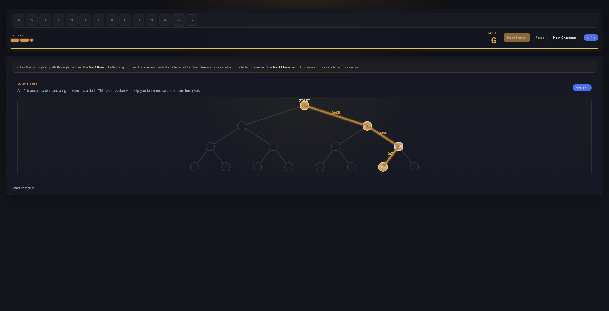

# Morse Learner

An online web app for people interested in learning Morse code using their own sentences and a helpful tree visualization.




## Process

- Enter a message or sequence of characters to start learning.
- The message is obfuscated using a [Vigenère cipher](https://en.wikipedia.org/wiki/Vigen%C3%A8re_cipher), translated to [Morse code](https://en.wikipedia.org/wiki/Morse_code), and stored.
- Copy or save the generated key, then open or share the link.
- Traverse the tree for each character and learn the patterns!

## Tech Stack

- Neon PostgreSQL
- React + TypeScript
- React Bootstrap (Bootstrap 5)
- Vercel

## Running locally

Install Node.js and npm from [here](https://docs.npmjs.com/downloading-and-installing-node-js-and-npm), then run:

```bash
npm install
npm start